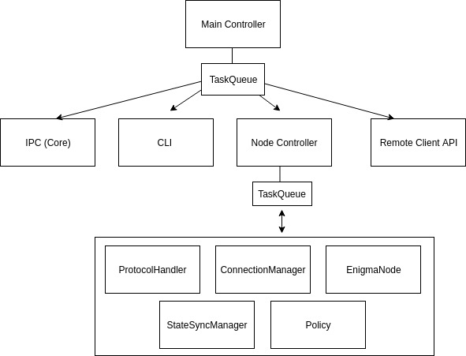

# enigma-p2p

 

[WIP] The Enigma Worker P2P package written in Node.js based on libp2p-js [WIP]

The P2P implementation of the Enigma Worker. This implementation is part of the Node stack running as a process on the OS communicating both with `Core` and the outside world.

# Getting Started

## Quick CLI 

First: 

`cd ./src/cli`

For help and list of flags: 

`node cli.js -h`

For launching the CLI with 1 bootstrap node type:

`node cli.js -n dns -i B1 -b B1 -p B1`

For the run-time commands the node can do: 

**While already running type**  `help`

To launch a worker(s) in a different terminal type:

(The nickname is for debugging, pick and string i.e peer1)

`node cli.js -b B1 -n <nickname>`

# Architechture

## Core, Enigma-P2P and the outside world

## Enigma-P2P High level design

## Prerequisites 
* TBD
## Installing
* TBD
# Running the Node
* TBD
# Running the tests
* TBD
# How it works
* TBD
## Peer Discovery
* TBD
## Syncing a Worker

### Consensus 

*WIP*

The Enigma Contract on Ethereum is used as the consensus layer. Contianing a Mapping between:

`Secret-Contract-Address` => `hash(WASM)`,`[hash(delta 0), ...hash(delta n)]`

Synchronizing the State means: 

    1) Having all the secret-contracts WASM code.
    2) Having all the state deltas for each secret-contract.
### Content Routing

*WIP*

The content routing is based on the libp2p implementation of IPFS using [CID](https://github.com/ipld/js-cid) to identify content and Kad-DHT for finding peers.

### Database 

*WIP*

All the information is stored encrypted inside a level-db instance on the disk. For each contract delta the key is a byte array of  `ethereum-hash + index`.

### Provide Content 

*WIP*

Providing Content is the process of announcing to the network a list of CID's.
A node announces the content it provides after it's being synchronized with the Enigma Contract on Ethereum.

### Find Content 

*WIP*

Finding content is the look up of certains CID's in the networking. 

### Synchronize Content 

*WIP*

Once a provider is found starts the synchronization process. 

## JSON RPC API
* TBD

## Built With

* [NodeJS](https://nodejs.org/en/)
* [Libp2p](https://libp2p.io/) - Networking library

## Authors
* TBD
## License

The Enigma Worker P2P is free software: you can redistribute it and/or modify it under the terms of the GNU Affero General Public License as published by
the Free Software Foundation, either version 3 of the License, or (at your option) any later version.

This program is distributed in the hope that it will be useful, but WITHOUT ANY WARRANTY; without even the implied warranty of MERCHANTABILITY or FITNESS FOR A PARTICULAR PURPOSE.  See the GNU Affero General Public License for more details.

You should have received a [copy](LICENSE) of the GNU Affero General Public License along with this program.  If not, see <https://www.gnu.org/licenses/>.

