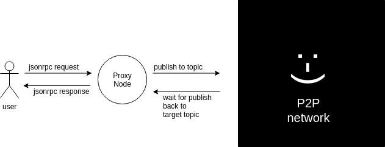

# enigma-p2p

The Enigma Worker P2P package written in Node.js based on libp2p-js

The P2P implementation of the Enigma Worker. This implementation is part of the Node stack running as a process on the OS communicating both with `Core` and the outside world.


| Branch | Build | Code Coverage | 
|--------|-------|---------------|
| Master |[](https://travis-ci.org/enigmampc/enigma-p2p) | [](https://codecov.io/gh/enigmampc/enigma-p2p) |
| Develop |[](https://travis-ci.org/enigmampc/enigma-p2p) | [](https://codecov.io/gh/enigmampc/enigma-p2p) |

# Table of Contents

- [enigma-p2p](#enigma-p2p)
- [Table of Contents](#table-of-contents)
- [Getting Started](#getting-started)
  - [Prerequisites](#prerequisites)
  - [Installing](#installing)
    - [If running with Docker](#if-running-with-docker)
  - [Installing globally with nvm](#installing-globally-with-nvm)
- [Running the Node](#running-the-node)
- [Running the tests](#running-the-tests)
- [JSON RPC API](#json-rpc-api)
- [Built With](#built-with)
- [Developers](#developers)
- [Authors](#authors)
- [License](#license)

# Getting Started


## Prerequisites

- [NodeJS](https://nodejs.org/en/)
- [Optional - Network Configuration]()
- [Optional - Docker](https://www.docker.com/)
- [During development for running tests - Global Truffle](https://truffleframework.com/)

## Installing

Until this module is not in npmjs.com: 

`git clone` this repository 

### If running with Docker

cd into the project directory and type:

`docker build .` 

To run later, save the final build hash or give it a name.

To run the node inside a container from the project directory type:

```
 docker run -v "$PWD":/usr/src/app -ti --net="host" <image-build-id> /bin/bash
```

## Installing globally with nvm 

1. install `nvm` 
2. install some node version : `$nvm install 11.15`
3. type `npm install -g enigma-p2p`
4. to run global type : `enigma-p2p-test <flags>`

Incase of missing modules such as `connect` and `tempdir` install them in the same way.

 `npm install -g <missing module name>`

# Running the Node

Currently the node is started based on a command line interface. 
The node can be start from a single configuration file:

 `some/path/enigma-p2p/configs/template1.js` 

 For usage example of single-config see [unit-test](https://github.com/enigmampc/enigma-p2p/blob/7825e490e789d4e52b441f390997f9b262b9cfbc/test/singleConfig/single_config_test.js#L39).

 Or with default configuration and CLI flags.

First:

`cd ./src/cli`

For help and list of flags:

`$node cli_app.js -h`

For the run-time commands the node can do:

**While already running type**  `help` to see a list of all the available commands. 

Example: 

1. launch a Bootstrap node: 

```
node cli_app.js -i B1 -b B1 -p B1 --core 127.0.0.1:1543 --proxy 3346 --random-db --mock-core
```

2. launch a regular worker node that will connect to the bootstrap: 

```
node cli_app.js -b B1 --core 127.0.0.1:6000 --random-db --mock-core
```

3. launch ANOTHER regular worker node that will connect to the bootstrap:

```
node cli_app.js -b B1 --core 127.0.0.1:6001 --random-db --mock-core
```

In this example: 

`--core <ip>:<port>` enigma-core uri. In this example we will be using a core simulation.

`--mock-core <ip>:<port>` launch a core simulation.

`--proxy <port>` will start up the JSONrpc server as well.

`--random-db` is a must to generate a temporary database for the task management during testing.

`-b` flag for the bootstrap node, `B1` is hard-coded for testing.

`-i` load specific node id from a hardcoded path.

`-p` run on a specific port since the bootstrap node is the first node everyone will connect to.


# Running the tests

Tests are based on `Mocha` and can invoked by typing:

`$npm test` 

# JSON RPC API

The [api](https://github.com/enigmampc/enigma-p2p/blob/develop/src/client_api/README.md) for interacting with a proxy node.

Usage example: 

1. Start a bootstrap node which is also a **Proxy**

```
node cli_app.js -i B1 -b B1 -p B1 --core 127.0.0.1:1543 --proxy 3346 --random-db 
```
2. start a regular worker that is **NOT** a proxy 

```
node cli_app.js -b B1 --core 127.0.0.1:6000 --random-db
```

3. IMPORTANT: assuming the worker from #2 is the selected one type `selfSubscribe` in the CLI so that the worker will subscribe to its own sign key. The key will be printed to std, copy it: 
   
```
   [Wed Mar 27 2019 17:41:06 GMT+0200 (Israel Standard Time)] DEBUG subscribed to [0xd71c1bccb4b238cea332201bab1cd0fa70bec080] self signKey
```

4. user wanting to call `getWorkerEncryptionKey` with `curl` see [example](https://github.com/enigmampc/enigma-p2p/blob/develop/src/client_api/README.md#getworkerencryptionkey) and use the key from step 3 as the `workerAddress` parameter.




# Built With

* [NodeJS](https://nodejs.org/en/)
* [Libp2p](https://libp2p.io/) - Networking library

# Developers

If you wish to learn more about the project and contribute make sure to checkout: 

1. [On boarding guide](docs/ON_BOARDING.md)
2. [In depth design](docs/ARCHITECTURE.md)

# Authors

* [Enigma](https://enigma.co/)

# License

The Enigma Worker P2P is free software: you can redistribute it and/or modify it under the terms of the GNU Affero General Public License as published by
the Free Software Foundation, either version 3 of the License, or (at your option) any later version.

This program is distributed in the hope that it will be useful, but WITHOUT ANY WARRANTY; without even the implied warranty of MERCHANTABILITY or FITNESS FOR A PARTICULAR PURPOSE.  See the GNU Affero General Public License for more details.

You should have received a [copy](LICENSE) of the GNU Affero General Public License along with this program.  If not, see <https://www.gnu.org/licenses/>.
