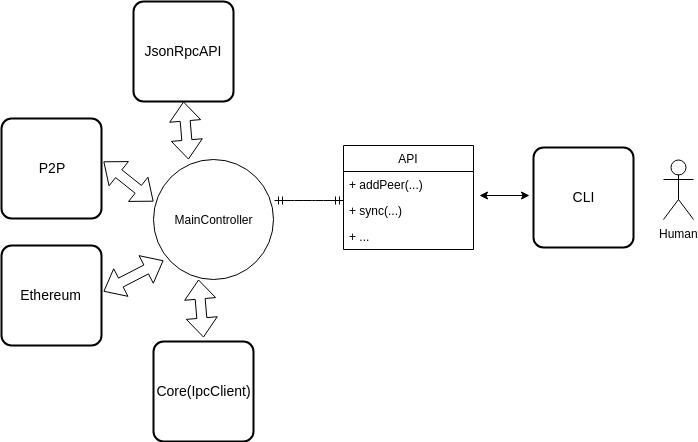

# enigma-p2p

 

[WIP] The Enigma Worker P2P package written in Node.js based on libp2p-js [WIP]

The P2P implementation of the Enigma Worker. This implementation is part of the Node stack running as a process on the OS communicating both with `Core` and the outside world.

# Getting Started

## Quick CLI

First:

`cd ./src/cli`

For help and list of flags:

`node cli.js -h`

For launching the CLI with 1 bootstrap node type:

`node cli.js -n dns -i B1 -b B1 -p B1`

For the run-time commands the node can do:

**While already running type**  `help`

To launch a worker(s) in a different terminal type:

(The nickname is for debugging, pick any string i.e peer1)

`node cli.js -b B1 -n <nickname>`

# Architechture

## Core, Enigma-P2P and the outside world

## Enigma-P2P High level design

* The components are essentially autonomous "runtimes".
* The MainController relays the communication with different Actions.
* The communication is done via Channels, which are bi-directional message-sending implementations.

## Prerequisites
* TBD
## Installing
* TBD
# Running the Node
* TBD
# Running the tests
* TBD
# How it works

## Overview on start 
At a very high level, the Worker needs to execute a sequence of steps 
and only then, it can start "Working". Here is a diagram explaining all of the initial steps the Worker has to do: 

* Start
   
Starting the node after Core. Set some configurations such as network settings, Ethereum wallet etc.

* Bootstrap

Connect to hardcoded well-known Bootstrap nodes to get seeds (i.e peers) from.

* Persistent Discovery

Service that is always alive and optimizes for "Optimal DHT" state
(i.e take care of connection stability).

* Sync State

Synchronize the Worker state: Secret contracts bytecode and deltas.

* Announce State 

Update the DHT registries with the content available (i.e deltas) for other peers to sync.

* Background Services 

Such as Ethereum listener, JSonRpcAPI etc.

* Register 

Register with Enigma.sol with all the required steps including Enclave Report.

## Peer Discovery
* TBD
## Syncing a Worker

Worker synchronization is done using libp2p content routing mechanisms. 
The architechture is sharded in its nature. 
We could think of **each contract as a chain of blocks**, and **each block** represents some **delta** in a **seuquence**. 
The first block is the bytecode, then we get delta 0, delta 1 and so on. 

The synchronization process consists of many parts and before diving in, here is what it **doesn't do** (some might call it **TODO**): 
1. protect again DOS/DDOS attacks. 
2. blacklist ip. 
3. re-use connection with a peer for more than 1 contract, i.e the full process of synching contract a and b will re-open the connection twice even if it's the same peer.

What it **does** today: 

1. handles back-pressure (requests are piped in sink-streams with max of 500 range for deltas)
2. shutdown the stream if something went wrong (i.e corrupted data)
3. optimized for simple lamptops with no hardware/bandwidth assumptions.
4. all the components in the process both the `Receiver`/`Provider` uses `sink-streams` all the way from the `request` to the `database` storage.

Without further due, let's look at the flow. 

### Consensus

The Enigma Contract on Ethereum is used as the consensus layer. Containing a Mapping between:

`Secret-Contract-Address` => `hash(WASM)`,`[hash(delta 0), ...hash(delta n)]`

Synchronizing the State means:

    1) Having all the secret-contracts WASM code.
    2) Having all the state deltas for each secret-contract.
**In the code:** 

[worker/IdentifyMissingStaetsAction](https://github.com/enigmampc/enigma-p2p/blob/develop/src/worker/controller/actions/sync/IdentifyMissingStatesAction.js) uses [StateSync](https://github.com/enigmampc/enigma-p2p/blob/develop/src/ethereum/StateSync.js) to get the `missing states map` it maps between addresses and delta/bytecode hashes that are missing. This is also used in the [verification stream](https://github.com/enigmampc/enigma-p2p/blob/develop/src/worker/state_sync/receiver/Receiver.js) to validate the corectness of the received data. 
In simple words, instead of going to Ethereum twice, once for identifying what is missing and the second time for verification, we reuse the same object. 

### Content Routing

The content routing is based on the libp2p implementation of IPFS using [CID](https://github.com/ipld/js-cid) to identify content and Kad-DHT for finding peers.

In the `enigma-p2p` the `CID` is wrapped with [EngCid](https://github.com/enigmampc/enigma-p2p/blob/develop/src/common/EngCID.js) and exposes convenient functions to use for the enigma use-case.  

**We use CID only to represent a contract address and nothing else.**

### Database

**The message definitions between `enigma-core` and `enigma-p2p` are defined [here](https://github.com/enigmampc/enigma-p2p/blob/develop/docs/IPC_MESSAGES.md)**

All the information is stored encrypted inside a rocks-db instance on the disk and `enigma-core` takes care of it. The `Read`/`Write` requests to the db are done via [CoreRuntime](https://github.com/enigmampc/enigma-p2p/blob/develop/src/core/CoreRuntime.js) that uses `zeromq` sockets for IPC.

**The only use of a database in enigma-p2p directly is for caching local tips (pointers to the local most recent contracts states)**

### Provide Content

Providing Content is the process of announcing to the network a list of CID's. **A node announces the content it provides after it's being synchronized with the Enigma Contract on Ethereum**.

Providing requires an announcements process which is done via [AnnounceLocalStateAction](https://github.com/enigmampc/enigma-p2p/blob/develop/src/worker/controller/actions/sync/AnnounceLocalStateAction.js). 

Nodes store in their `DHT` a mapping between `CID` and provider peers.

### Find Content

This is the role of the `Receiver`. 
Finding content is the look up of certains CID's in the network. 
Finding content requires 2 steps: 
1. Get the local state. 
2. Get the remote state. 

The delta between the Remote and the local is **what needs to be synched**.

This is a diagram demonstrating the use of the action [IdentifyMissingStatesAction](https://github.com/enigmampc/enigma-p2p/blob/develop/src/worker/controller/actions/sync/IdentifyMissingStatesAction.js) that will take care of both steps (thanks to @lenak25 implementation of remote states). 

**TODO::** from cache is currently not integrated but definatly implemented with [tests](https://github.com/enigmampc/enigma-p2p/blob/develop/test/db_cache_test.js) to support it.

### Find Content Providers

Ok, so we know **what** is missing, now we need to find **who** can provide with that. There is a list for each CID since peers might go offline or be malicioous etc.

Again, this is from the `Receiver` prespective triggering [ContentProviderAction](https://github.com/enigmampc/enigma-p2p/blob/develop/src/worker/controller/actions/sync/FindContentProviderAction.js). 

The end result of this action is a map of `CID`'s to `providers` (peers) that can provide that CID. 

**TODO::** optimize on connections, i.e if a peer exists in all of the CID's then reuse the connection. 

### Synchronize Content

From the `Receiver` prespective it all starts with [TryReceiveAllAction](https://github.com/enigmampc/enigma-p2p/blob/develop/src/worker/controller/actions/sync/TryReceiveAllAction.js). At the moment we sync 
each contract one-by-one because:
1. It's safer to manage 
2. It takes no assumption of good hardware/bandwith

At the high-level the process of managing the synchronization of **all** the secret contracts: 

Phew, this is not simple. If we go deeper, there can be faults i.e peer go offline, malicious peer, corrupted data etc. So this is the process of receiving **one** secret contract (this is in-depth look into the yellow circle saying `Sync` in the above diagram): 

It's not over yet, if we look deeper, in the above diagram there is a state that's called `Sync-Receive contract`. This is the actuall flow of passing bytes around between 2 peers: 

- [Provider](https://github.com/enigmampc/enigma-p2p/tree/develop/src/worker/state_sync/provider)
- [Receiver](https://github.com/enigmampc/enigma-p2p/blob/develop/src/worker/state_sync/receiver/Receiver.js)
- [streams implementation](https://github.com/enigmampc/enigma-p2p/blob/develop/src/worker/state_sync/streams.js)

A `Receiver` can request either a bytecode or deltas (limited up to 500 deltas per request). To handle backpressure and DOS attacks each request is handled once the previous is done, i.e the `Receiver` will send another reuqest to the `Provider` only after verifying and storing the current request. 

The [messages](https://github.com/enigmampc/enigma-p2p/blob/develop/definitions/states_sync_sequence) can be: 
- STATE_SYNC_REQ/RES
- SYNC_BCODE_REQ/RES

## JSON RPC API

* TBD

## Built With

* [NodeJS](https://nodejs.org/en/)
* [Libp2p](https://libp2p.io/) - Networking library

## Authors

* TBD

## License

The Enigma Worker P2P is free software: you can redistribute it and/or modify it under the terms of the GNU Affero General Public License as published by
the Free Software Foundation, either version 3 of the License, or (at your option) any later version.

This program is distributed in the hope that it will be useful, but WITHOUT ANY WARRANTY; without even the implied warranty of MERCHANTABILITY or FITNESS FOR A PARTICULAR PURPOSE.  See the GNU Affero General Public License for more details.

You should have received a [copy](LICENSE) of the GNU Affero General Public License along with this program.  If not, see <https://www.gnu.org/licenses/>.
