# enigma-p2p
| Branch | Build | Code Coverage | 
|--------|-------|---------------|
| Master |[](https://travis-ci.com/enigmampc/enigma-p2p) | [](https://codecov.io/gh/enigmampc/enigma-p2p) |
| Develop |[](https://travis-ci.com/enigmampc/enigma-p2p) | [](https://codecov.io/gh/enigmampc/enigma-p2p) |

[WIP] The Enigma Worker P2P package written in Node.js based on libp2p-js [WIP]

The P2P implementation of the Enigma Worker. This implementation is part of the Node stack running as a process on the OS communicating both with `Core` and the outside world.

# Table of Contents

- [enigma-p2p](#enigma-p2p)
- [Table of Contents](#table-of-contents)
- [Getting Started](#getting-started)
  - [Quick CLI](#quick-cli)
- [Architechture](#architechture)
  - [Core P2P and the outside world](#core-p2p-and-the-outside-world)
  - [P2P High level design](#p2p-high-level-design)
  - [NodeController and internals](#nodecontroller-and-internals)
  - [General concepts](#general-concepts)
    - [Event driven and notifications](#event-driven-and-notifications)
    - [Command pattern and Actions](#command-pattern-and-actions)
    - [Controllers](#controllers)
    - [Constants](#constants)
  - [Runtimes and the main controller](#runtimes-and-the-main-controller)
    - [Main controller](#main-controller)
    - [Runtimes](#runtimes)
    - [Channels and Communicators](#channels-and-communicators)
    - [Api controller](#api-controller)
    - [Creating main controller instance](#creating-main-controller-instance)
  - [The Worker - everything libp2p.](#the-worker---everything-libp2p)
    - [Libp2p configuration](#libp2p-configuration)
    - [EnigmaNode](#enigmanode)
    - [P2P Messages](#p2p-messages)
    - [Incoming requests](#incoming-requests)
    - [PeerBank](#peerbank)
    - [Discovery and bootstrap](#discovery-and-bootstrap)
    - [State synchronization](#state-synchronization)
    - [PubSub - how to "broadcast"](#pubsub---how-to-%22broadcast%22)
    - [Connecting it all - controller](#connecting-it-all---controller)
    - [creating NodeController instance](#creating-nodecontroller-instance)
  - [Prerequisites](#prerequisites)
  - [Installing](#installing)
- [Running the Node](#running-the-node)
- [Running the tests](#running-the-tests)
- [How it works](#how-it-works)
  - [Overview on start](#overview-on-start)
  - [Persistent Peer Discovery](#persistent-peer-discovery)
  - [Syncing a Worker](#syncing-a-worker)
    - [Consensus](#consensus)
    - [Content Routing](#content-routing)
    - [Database](#database)
    - [Provide Content](#provide-content)
    - [Find Content](#find-content)
    - [Find Content Providers](#find-content-providers)
    - [Synchronize Content](#synchronize-content)
  - [JSON RPC API](#json-rpc-api)
  - [Built With](#built-with)
  - [Authors](#authors)
  - [License](#license)


# Getting Started

## Quick CLI


First:

`cd ./src/cli`

For help and list of flags:

`$node cli_app.js -h`

For interactive-options help type `$help` while running. 

For quick launching with default the CLI with 1 bootstrap node type:

`node cli_app.js -n dns -i B1 -b B1 -p B1 --core <ip>:<port> --proxy <port>`

For the run-time commands the node can do:

**While already running type**  `help`

for quick launch with default worker(s) in a different terminal type:

`node cli_app.js -b B1 --core <ip>:<port> --proxy <port>`

`--core <ip>:<port>` flag will start a mock server on the given port and connect to it. 

`--proxy <port>` will start up the JSONrpc server as well.
 
# Architechture

## Core P2P and the outside world

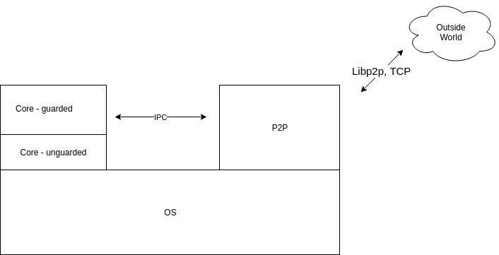

## P2P High level design
 
 

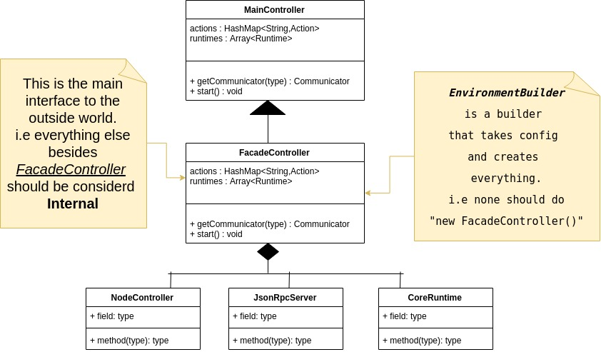


* The components `NodeController`, `JsonRpcServer`, `CoreRuntime` are essentially autonomous "runtimes".
* The MainController relays the communication with different Actions.
* The communication is done via Channels, which are bi-directional message-sending implementations.
  

## NodeController and internals

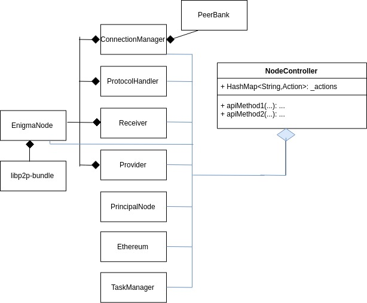

## General concepts

The enigma-p2p is asynchronous in its nature and has different concepts that are applied in the architecture.

### Event driven and notifications  

Everything is based on notifications and responses to those notifications. 
Notifications in the project come in 2 forms: 

1) [EventEmitter](https://nodejs.org/api/events.html#events_events) 
    - are used inside [Worker](https://github.com/enigmampc/enigma-p2p/tree/mexico_branch/src/worker) often. This is how the components communicate with the [NodeController](https://github.com/enigmampc/enigma-p2p/blob/6dddeb5e1e3f7d20e0c9c647be8bad7140bc1285/src/worker/controller/NodeController.js#L124)
    - for example the [ConnectionManager](https://github.com/enigmampc/enigma-p2p/blob/6dddeb5e1e3f7d20e0c9c647be8bad7140bc1285/src/worker/handlers/ConnectionManager.js#L299) will notify on a finished handshake and let the `NodeController` decide [what to do with it](https://github.com/enigmampc/enigma-p2p/blob/6dddeb5e1e3f7d20e0c9c647be8bad7140bc1285/src/worker/controller/NodeController.js#L72).

2) Channels and communicators

    -Explained later in the `Main Controller` section, used for `request/response` type of communication unlike `EventEmitter` where it is stateless. 


### Command pattern and Actions 

Since everything is Event driven it means that we want to trigger different things once some event occurs. The design here is based on classic [Command Pattern](https://en.wikipedia.org/wiki/Command_pattern) but with modidications to fit NodeJS style. 
Terminology wise, it's called **Actions**. 
Everywhere in the project `notifications` lead to `Actions`. 
The rational here is that objects hold the **concrete implementation**  and Actions are the **operational logic**. 

Actions are everywhere: 
- [Worker](https://github.com/enigmampc/enigma-p2p/tree/mexico_branch/src/worker/controller/actions)
- [MainController](https://github.com/enigmampc/enigma-p2p/tree/mexico_branch/src/main_controller/actions)
- [CoreRuntime](https://github.com/enigmampc/enigma-p2p/tree/mexico_branch/src/core/actions)
  
Actions must implement `execute(params)` function and usually take `context` object in their constructor. 

To summarize, `Actions` are holding the **operational logic** when to call functions and in which order and it seperates the `invokation` from the `execution`. 

**Pipelines**

Sometimes different functions needs to be called together, those are called `PipelineAction` and they will be only responsible for calling the other Actions and parsing input/output between them. [Example ReceiveAllPipelineAction](https://github.com/enigmampc/enigma-p2p/blob/mexico_branch/src/worker/controller/actions/sync/ReceiveAllPipelineAction.js).

### Controllers

There are a lot of components that need to talk to each other. 
So there is a hierarchy. The controllers are mapping `notifications` that are emitted to `Actions` that need to be executed. 

For example, the [NodeController](https://github.com/enigmampc/enigma-p2p/tree/mexico_branch/src/worker/controller). 

**!!! Every controller also exposes a [FACADE](https://en.wikipedia.org/wiki/Facade_pattern) to the other things in the project. !!!**

This is how user can call direct `Actions` such as `connect to peers` etc. 

### Constants 

All the constants go [here](https://github.com/enigmampc/enigma-p2p/blob/mexico_branch/src/common/constants.js). 


## Runtimes and the main controller

Each component such as the Worker, CoreRuntime, etc are `Runtimes` and there is a main controller that connects between them. 

The reasoning here is again, seperation of concerns.

### Main controller 

The [MainController](https://github.com/enigmampc/enigma-p2p/blob/6dddeb5e1e3f7d20e0c9c647be8bad7140bc1285/src/main_controller/MainController.js#L1), documented in a comment, is also based on `Actions` with slightly different concepts. 

### Runtimes 

The different Runtimes need to implement 2 methods: 

`type() : string`
    
This method returns the Runtime [name](https://github.com/enigmampc/enigma-p2p/blob/6dddeb5e1e3f7d20e0c9c647be8bad7140bc1285/src/common/constants.js#L97). 

`setChannel(Communicator)` 

This method sets the communicator for each Runtime to talk with the MainController ([example](https://github.com/enigmampc/enigma-p2p/blob/6dddeb5e1e3f7d20e0c9c647be8bad7140bc1285/src/worker/controller/NodeController.js#L208)).

### Channels and Communicators 

Runtime communication is usually `request/response`, which is why simple `EventEmmitter` is not enough. 

For example, when `Worker` component needs something from the DB, it will use a `Channel` and wait for a response.

The [Channel](https://github.com/enigmampc/enigma-p2p/blob/mexico_branch/src/main_controller/channels/Channel.js) class is responsible for creating 2 [Communicator](https://github.com/enigmampc/enigma-p2p/blob/mexico_branch/src/main_controller/channels/Communicator.js) instances.
The message types between 2 Communicators are of type [Envelop](https://github.com/enigmampc/enigma-p2p/blob/6dddeb5e1e3f7d20e0c9c647be8bad7140bc1285/src/main_controller/channels/Envelop.js#L3) class.

The "big" innovation here is the `sendAndReceive(envelop)` method.

example:

```javascript
const Envelop = require('./Envelop');
let communicators = Channel.biDirectChannel();
let c1 = communicators.channel1;
let c2 = communicators.channel2;

c1.setOnMessage((envelop)=>{
    console.log(envelop);
    let e = new Envelop(envelop.id(),{msg : 'this is lena '}, 'target runtime action');
    c1.send(e);
});
  // envelop
let e1 = new Envelop(true,{msg : 'who is it? '}, 'target runtime action');

let responseEnvelop = await c2.sendAndReceive(e1);
console.log("response: " + responseEnvelop);
```

### Api controller 

The MainController exposes a [FACADE](https://en.wikipedia.org/wiki/Facade_pattern) to all the Runtimes. 
This is what the **CLI is talking to**.

**TODO::**

The Facade is implemented in [FacadeController](https://github.com/enigmampc/enigma-p2p/blob/6dddeb5e1e3f7d20e0c9c647be8bad7140bc1285/src/main_controller/FacadeController.js#L12) and should be adding [concrete methods](https://github.com/enigmampc/enigma-p2p/blob/6dddeb5e1e3f7d20e0c9c647be8bad7140bc1285/src/main_controller/FacadeController.js#L10) there that will define the general API, currently this is very unstable which is why the CLI calls the [components directly](https://github.com/enigmampc/enigma-p2p/blob/6dddeb5e1e3f7d20e0c9c647be8bad7140bc1285/src/cli/cli_app.js#L196). 

### Creating main controller instance 

There is a [Builder](https://github.com/enigmampc/enigma-p2p/blob/6dddeb5e1e3f7d20e0c9c647be8bad7140bc1285/src/main_controller/EnvironmentBuilder.js#L9) :-) 

[Example](https://github.com/enigmampc/enigma-p2p/blob/6dddeb5e1e3f7d20e0c9c647be8bad7140bc1285/src/cli/cli_app.js#L180) of how the CLI uses the builder to create an instance. 

## The Worker - everything libp2p. 

The worker runtime is everything that relates to messaging and the p2p. 

### Libp2p configuration 

Besides the configuration in common/constants.js there are specific libp2p configurations, such as [PeerBundle](https://github.com/enigmampc/enigma-p2p/blob/6dddeb5e1e3f7d20e0c9c647be8bad7140bc1285/src/worker/libp2p-bundle.js#L12). 

### EnigmaNode

The [EnigmaNode](https://github.com/enigmampc/enigma-p2p/blob/6dddeb5e1e3f7d20e0c9c647be8bad7140bc1285/src/worker/EnigmaNode.js#L20) is a wrapper to the `PeerBundle` from above. It implements specific p2p functions for enigma. Nothing should talk directly to the `PeerBundle`. Everything low-level that requires `PeerBundle` directly should go through this class instead.

Just to emphasize: if one needs some specific function for libp2p-dht that does not exist yet in the `EnigmaNode` class, it should be implemented here and wrapped. 

### P2P Messages 

The messages are used as [concrete classes](https://github.com/enigmampc/enigma-p2p/tree/6dddeb5e1e3f7d20e0c9c647be8bad7140bc1285/src/policy/p2p_messages). They are documented [here](https://github.com/enigmampc/enigma-p2p/tree/6dddeb5e1e3f7d20e0c9c647be8bad7140bc1285/docs) along side with `IPC_MESSAGES.md`. There might be minor differences between what is documented and what is implemented. 


### Incoming requests 

All the inbound messages get accepted by the [ProtocolHandler](https://github.com/enigmampc/enigma-p2p/blob/6dddeb5e1e3f7d20e0c9c647be8bad7140bc1285/src/worker/handlers/ProtcolHandler.js#L18) class. 
Building on top of libp2p terminology, different messages are different protocols and each one gets its own [handler](https://github.com/enigmampc/enigma-p2p/blob/6dddeb5e1e3f7d20e0c9c647be8bad7140bc1285/src/worker/handlers/ProtcolHandler.js#L42). 

### PeerBank 

[PeerBank](https://github.com/enigmampc/enigma-p2p/blob/6dddeb5e1e3f7d20e0c9c647be8bad7140bc1285/src/worker/handlers/PeerBank.js#L5) is a class that holds **potential** peers. Once the node connects to some `peer_x` it will be removed from the `PeerBank`.
This is used to collect peers via `findpeers` message and the `seeds` that come from `Pong` messages.

### Discovery and bootstrap 

The login of what to do is implemented in the [ConnectionManager](https://github.com/enigmampc/enigma-p2p/blob/6dddeb5e1e3f7d20e0c9c647be8bad7140bc1285/src/worker/handlers/ConnectionManager.js) but the operational logic is implemented in [ConsistentDiscoveryAction](https://github.com/enigmampc/enigma-p2p/blob/6dddeb5e1e3f7d20e0c9c647be8bad7140bc1285/src/worker/controller/actions/connectivity/ConsistentDiscoveryAction.js), usage [example](https://github.com/enigmampc/enigma-p2p/blob/6dddeb5e1e3f7d20e0c9c647be8bad7140bc1285/src/worker/controller/NodeController.js#L290).

### State synchronization

**Receiver**

A [class](https://github.com/enigmampc/enigma-p2p/blob/6dddeb5e1e3f7d20e0c9c647be8bad7140bc1285/src/worker/state_sync/receiver/Receiver.js#L13) that responsible for the content receiving logic.

**Provider**

A [class](https://github.com/enigmampc/enigma-p2p/blob/6dddeb5e1e3f7d20e0c9c647be8bad7140bc1285/src/worker/state_sync/provider/Provider.js#L9) that responsible for the content providing logic.

**Streams**

All the streams are in [one place](https://github.com/enigmampc/enigma-p2p/blob/6dddeb5e1e3f7d20e0c9c647be8bad7140bc1285/src/worker/state_sync/streams.js). If a stream needs a stateful reference, for example the ability to query the database, it should be initialized in the `setGlobalState()` method. 

**Related Actions**

The [Actions](https://github.com/enigmampc/enigma-p2p/tree/mexico_branch/src/worker/controller/actions/sync) with the operational logic inside `NodeController`. 

### PubSub - how to "broadcast"

This is a great way of communicating with Nodes in the network using the DHT. Essentially this is a `Multicast` based on `publish/subscribe` architecture. 

Nodes can subscribe to different topics and publish messages to those topics. 

An [example](https://github.com/enigmampc/enigma-p2p/blob/6dddeb5e1e3f7d20e0c9c647be8bad7140bc1285/src/worker/controller/NodeController.js#L298) (`$broadcast <msg>` in the cli) of publishing to `broadcast` topic. 

Subscribe [example](https://github.com/enigmampc/enigma-p2p/blob/6dddeb5e1e3f7d20e0c9c647be8bad7140bc1285/src/worker/EnigmaNode.js#L199) and the [handler](https://github.com/enigmampc/enigma-p2p/blob/6dddeb5e1e3f7d20e0c9c647be8bad7140bc1285/src/worker/handlers/ProtcolHandler.js#L92) for a message. 

**This functionality is great for the JSONRPC api to propagate messages to the network from a proxy node the dApp user is connected to**.

### Connecting it all - controller 

There are more things in [Worker](https://github.com/enigmampc/enigma-p2p/tree/mexico_branch/src/worker) and all of them are managed by the [NodeController](https://github.com/enigmampc/enigma-p2p/blob/6dddeb5e1e3f7d20e0c9c647be8bad7140bc1285/src/worker/controller/NodeController.js#L43) that maps `notifications` to `Actions`.

**The NodeController exposes the Facade API for the Worker p2p things**

### creating NodeController instance 

`initDefaultTemplate(options,logger)` is for creating a new [instance](https://github.com/enigmampc/enigma-p2p/blob/6dddeb5e1e3f7d20e0c9c647be8bad7140bc1285/src/worker/controller/NodeController.js#L102). 

## Prerequisites
* TBD
## Installing
* TBD
# Running the Node
* TBD
# Running the tests

```bash
sudo npm install -g truffle
git clone git@github.com:enigmampc/enigma-p2p.git
cd enigma-p2p
npm install
npm run test
```

Currently v8.0.0 <= Node.JS <= v11.15.0 is required because web3 v1.0.0-beta.54 requires it. In the future this restriction will be lifted.

If while running the tests you recieve an `Address already in use` error, try running `sudo netstat -ltnp` to see which processes on your machine are already using one of the ports `5555`, `5556`, `5557`, `5558`, `6785`, `7890` (from `./test/ipc_test.js`).

# How it works

## Overview on start 
At a very high level, the Worker needs to execute a sequence of steps 
and only then, it can start "working". Here is a diagram explaining all of the initial steps the Worker has to do: 

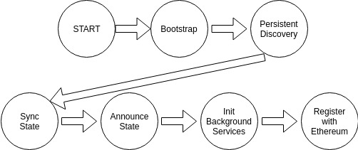

* Start
   
Starting the node after Core. Set some configurations such as network settings, Ethereum wallet etc.

* Bootstrap

Connect to hardcoded well-known Bootstrap nodes to get seeds (i.e peers) from.

* Persistent Discovery

Service that is always alive and optimizes for "Optimal DHT" state
(i.e take care of connection stability).

* Sync State

Synchronize the Worker state: Secret contracts bytecode and deltas.

* Announce State 

Update the DHT registries with the content available (i.e deltas) for other peers to sync.

* Background Services 

Such as Ethereum listener, JsonRpcAPI etc.

* Register 

Register with Enigma.sol with all the required steps including Enclave Report.

## Persistent Peer Discovery

**The goal:** 

reach **optimal DHT** which [defaults to 8 outbound connections](https://github.com/enigmampc/enigma-p2p/blob/013b687fedf334b0566720a98bf1f9799989a0fe/src/common/constants.js#L65).

The persistent peer discovery can be tested with `$discover` cli command. 
This will trigger `CONSISTENT_DISCOVERY` notification which maps to [ConsistentDiscoveryAction](https://github.com/enigmampc/enigma-p2p/blob/develop/src/worker/controller/actions/connectivity/ConsistentDiscoveryAction.js) with the following default params: 
```json
'delay': 500,
'maxRetry': 10,
'timeout': 100000,
```

This can be called upon everytime a [disconnect event](https://github.com/enigmampc/enigma-p2p/blob/013b687fedf334b0566720a98bf1f9799989a0fe/src/worker/handlers/ProtcolHandler.js#L300) happens. 


First, Bootstrapping the network (happens before `ConsistentPeerDiscovery`). 
We start handshaking `Bootstrap nodes` that are hardcoded into the code or added manually in the [cli](https://github.com/enigmampc/enigma-p2p/blob/013b687fedf334b0566720a98bf1f9799989a0fe/src/cli/cli_app.js#L171).

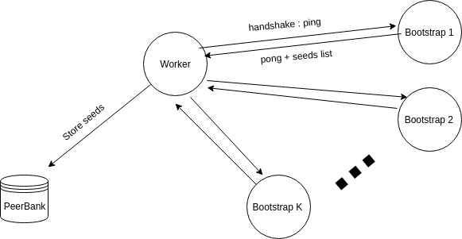

Then we do persistent discovery based on Visitor Pattern.

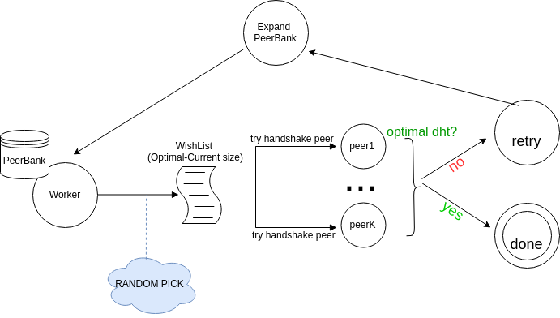
## Syncing a Worker

Worker synchronization is done using libp2p content routing mechanisms. 
The architechture is sharded in its nature. 
We could think of **each contract as a chain of blocks**, and **each block** represents some **delta** in a **seuquence**. 
The first block is the bytecode, then we get delta 0, delta 1 and so on. 

The synchronization process consists of many parts and before diving in, here is what it **doesn't do** (some might call it **TODO**): 
1. protect again DOS/DDOS attacks. 
2. blacklist ip. 
3. re-use connection with a peer for more than 1 contract, i.e the full process of synching contract a and b will re-open the connection twice even if it's the same peer.

What it **does** today: 

1. handles back-pressure (requests are piped in sink-streams with max of 500 range for deltas)
2. shutdown the stream if something went wrong (i.e corrupted data)
3. optimized for simple lamptops with no hardware/bandwidth assumptions.
4. all the components in the process both the `Receiver`/`Provider` uses `sink-streams` all the way from the `request` to the `database` storage.

Without further due, let's look at the flow. 


### Consensus

The Enigma Contract on Ethereum is used as the consensus layer, containing a mapping between:

`Secret-Contract-Address` => `hash(WASM)`,`[hash(delta 0), ...hash(delta n)]`

Synchronizing the State means:

    1) Having all the secret-contracts WASM code.
    2) Having all the state deltas for each secret-contract.
**In the code:** 

[worker/IdentifyMissingStaetsAction](https://github.com/enigmampc/enigma-p2p/blob/develop/src/worker/controller/actions/sync/IdentifyMissingStatesAction.js) uses [StateSync](https://github.com/enigmampc/enigma-p2p/blob/develop/src/ethereum/StateSync.js) to get the `missing states map` it maps between addresses and delta/bytecode hashes that are missing. This is also used in the [verification stream](https://github.com/enigmampc/enigma-p2p/blob/develop/src/worker/state_sync/receiver/Receiver.js) to validate the corectness of the received data. 
In simple words, instead of going to Ethereum twice, once for identifying what is missing and the second time for verification, we reuse the same object. 

### Content Routing

The content routing is based on the libp2p implementation of IPFS using [CID](https://github.com/ipld/js-cid) to identify content and Kad-DHT for finding peers.

In the `enigma-p2p` the `CID` is wrapped with [EngCid](https://github.com/enigmampc/enigma-p2p/blob/develop/src/common/EngCID.js) and exposes convenient functions to use for the enigma use-case.  

**We use CID only to represent a contract address and nothing else.**

### Database

**The message definitions between `enigma-core` and `enigma-p2p` are defined [here](https://github.com/enigmampc/enigma-p2p/blob/develop/docs/IPC_MESSAGES.md)**

All the information is stored encrypted inside a rocks-db instance on the disk and `enigma-core` takes care of it. The `Read`/`Write` requests to the db are done via [CoreRuntime](https://github.com/enigmampc/enigma-p2p/blob/develop/src/core/CoreRuntime.js) that uses `zeromq` sockets for IPC.

**The only use of a database in enigma-p2p directly is for caching local tips (pointers to the local most recent contracts states)**

### Provide Content

Providing Content is the process of announcing to the network a list of CID's. **A node announces the content it provides after it's being synchronized with the Enigma Contract on Ethereum**.

Providing requires an announcements process which is done via [AnnounceLocalStateAction](https://github.com/enigmampc/enigma-p2p/blob/develop/src/worker/controller/actions/sync/AnnounceLocalStateAction.js). 

Nodes store in their `DHT` a mapping between `CID` and provider peers.

### Find Content

This is the role of the `Receiver`. 
Finding content is the look up of certains CID's in the network. 
Finding content requires 2 steps: 
1. Get the local state. 
2. Get the remote state. 

The delta between the Remote and the local is **what needs to be synched**.

This is a diagram demonstrating the use of the action [IdentifyMissingStatesAction](https://github.com/enigmampc/enigma-p2p/blob/develop/src/worker/controller/actions/sync/IdentifyMissingStatesAction.js) that will take care of both steps (thanks to @lenak25 implementation of remote states). 


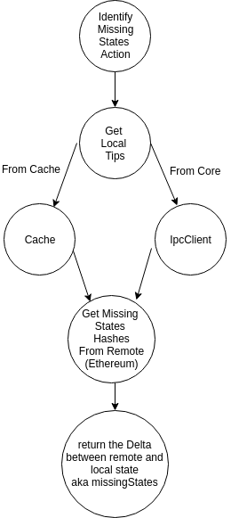

**TODO::** from cache is currently not integrated but definitely implemented with [tests](https://github.com/enigmampc/enigma-p2p/blob/develop/test/db_cache_test.js) to support it.

### Find Content Providers

Ok, so we know **what** is missing, now we need to find **who** can provide it. There is a list for each CID since peers might go offline or be malicioous etc.

Again, this is from the `Receiver` perspective triggering [ContentProviderAction](https://github.com/enigmampc/enigma-p2p/blob/develop/src/worker/controller/actions/sync/FindContentProviderAction.js). 


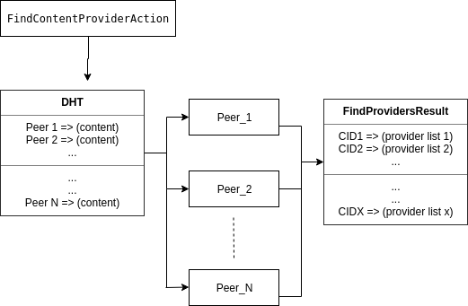

The end result of this action is a map of `CID`'s to `providers` (peers) that can provide that CID. 

**TODO::** optimize on connections, i.e if a peer exists in all of the CID's then reuse the connection. 

### Synchronize Content

From the `Receiver` perspective it all starts with [TryReceiveAllAction](https://github.com/enigmampc/enigma-p2p/blob/develop/src/worker/controller/actions/sync/TryReceiveAllAction.js). At the moment we sync 
each contract one-by-one because:
1. It's safer to manage 
2. It takes no assumption of good hardware/bandwith

At the high-level the process of managing the synchronization of **all** the secret contracts: 

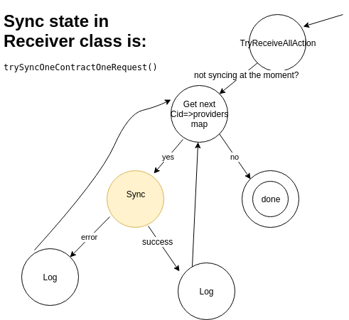

Phew, this is not simple. If we go deeper, there can be faults i.e peer go offline, malicious peer, corrupted data etc. So this is the process of receiving **one** secret contract (this is in-depth look into the yellow circle saying `Sync` in the above diagram): 

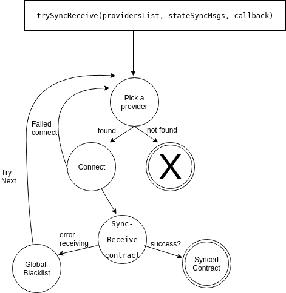

It's not over yet, if we look deeper, in the above diagram there is a state that's called `Sync-Receive contract`. This is the actuall flow of passing bytes around between 2 peers: 

- [Provider](https://github.com/enigmampc/enigma-p2p/tree/develop/src/worker/state_sync/provider)
- [Receiver](https://github.com/enigmampc/enigma-p2p/blob/develop/src/worker/state_sync/receiver/Receiver.js)
- [streams implementation](https://github.com/enigmampc/enigma-p2p/blob/develop/src/worker/state_sync/streams.js)

A `Receiver` can request either a bytecode or deltas (limited up to 500 deltas per request). To handle backpressure and DOS attacks each request is handled once the previous is done, i.e the `Receiver` will send another reuqest to the `Provider` only after verifying and storing the current request. 

The [messages](https://github.com/enigmampc/enigma-p2p/blob/develop/definitions/states_sync_sequence) can be: 
- STATE_SYNC_REQ/RES
- SYNC_BCODE_REQ/RES


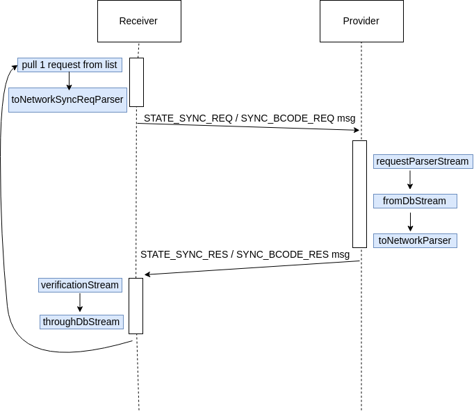

## JSON RPC API


## Built With

* [NodeJS](https://nodejs.org/en/)
* [Libp2p](https://libp2p.io/) - Networking library

## Authors

* TBD

## License

The Enigma Worker P2P is free software: you can redistribute it and/or modify it under the terms of the GNU Affero General Public License as published by
the Free Software Foundation, either version 3 of the License, or (at your option) any later version.

This program is distributed in the hope that it will be useful, but WITHOUT ANY WARRANTY; without even the implied warranty of MERCHANTABILITY or FITNESS FOR A PARTICULAR PURPOSE.  See the GNU Affero General Public License for more details.

You should have received a [copy](LICENSE) of the GNU Affero General Public License along with this program.  If not, see <https://www.gnu.org/licenses/>.
